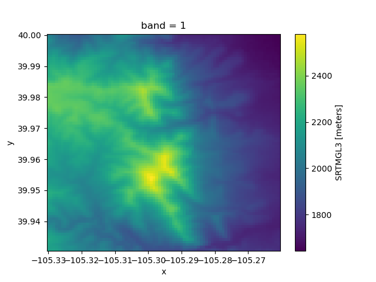

[](https://bmi.readthedocs.io/)
[](https://anaconda.org/conda-forge/bmi-topography)
[](https://pypi.org/project/bmi-topography)
[](https://github.com/csdms/bmi-topography/actions/workflows/build-test-ci.yml)
[](https://coveralls.io/github/csdms/bmi-topography?branch=main)
[](https://bmi-topography.readthedocs.io/en/latest/?badge=latest)

# bmi-topography

*bmi-topography* is a Python library for fetching and caching
land elevation data
using the [OpenTopography][ot] [REST API][ot-rest].

The *bmi-topography* library provides access to the following global raster datasets:

* SRTMGL3 (SRTM GL3 90m)
* SRTMGL1 (SRTM GL1 30m)
* SRTMGL1_E (SRTM GL1 Ellipsoidal 30m)
* AW3D30 (ALOS World 3D 30m)
* AW3D30_E (ALOS World 3D Ellipsoidal, 30m)
* SRTM15Plus (Global Bathymetry SRTM15+ V2.1)
* NASADEM (NASADEM Global DEM)
* COP30 (Copernicus Global DSM 30m)
* COP90 (Copernicus Global DSM 90m)

The library includes an API and a CLI that accept
the dataset type,
a latitude-longitude bounding box, and
the output file format.
Data are downloaded from OpenTopography and cached locally.
The cache is checked before downloading new data.
Data from a cached file can optionally be loaded into an
[xarray][xarray] [DataArray][xarray-da]
through [rioxarray][rioxarray].

The *bmi-topography* API is wrapped with a
[Basic Model Interface][bmi] (BMI),
which provides a standard set of functions for coupling with data or models
that also expose a BMI.
More information on the BMI can found in its [documentation][bmi].

## Installation

Install the latest stable release of *bmi-topography* with `pip`:
```
pip install bmi-topography
```
or with `conda`:
```
conda install -c conda-forge bmi-topography
```

The *bmi-topography* library can also be built and installed from source.
The library uses several other open source libraries,
so a convenient way of building and installing it is within a
[conda environment][conda-env].
After cloning or downloading the *bmi-topography*
[repository][bmi-topo-repo],
change into the repository directory
and set up a conda environment with the included environment file:
```
conda env create --file=environment.yml
```
Then build and install *bmi-topography* from source with
```
pip install -e .
```

## API key

To better understand usage,
OpenTopography [requires an API key][ot-api-key] to access datasets they host.
Getting an API key is easy, and it's free:
just follow the instructions in the link above.

Once you have an API key,
there are three ways to use it with *bmi-topography*:

1. *parameter*: Pass the API key as a string through the `api_key` parameter.
2. *environment variable*: In the shell, set the `OPENTOPOGRAPHY_API_KEY` environment variable to the API key value.
3. *dot file*: Put the API key in the file `.opentopography.txt` in the current directory or in your home directory.

If you attempt to use *bmi-topography* to access an OpenTopography dataset without an API key,
you'll get a error like this: 
```
requests.exceptions.HTTPError: 401 Client Error: This dataset requires an API Key for access.
```

## Examples

A brief example of using the *bmi-topography* API is given in the following steps.

Start a Python session and import the `Topography` class:
```python
>>> from bmi_topography import Topography
```

For convenience,
a set of default parameter values for `Topography` are included in the class definition.
Copy these and modify them with custom values:
```python
>>> params = Topography.DEFAULT.copy()
>>> params["south"] = 39.93
>>> params["north"] = 40.00
>>> params["west"] = -105.33
>>> params["east"] = -105.26
>>> params
{'dem_type': 'SRTMGL3',
 'south': 39.93,
 'north': 40.0,
 'west': -105.33,
 'east': -105.26,
 'output_format': 'GTiff',
 'cache_dir': '~/.bmi_topography'}
```
These coordinate values represent an area around Boulder, Colorado.

Make a instance of `Topography` with these parameters:
```python
>>> boulder = Topography(**params)
```
then fetch the data from OpenTopography:
```python
>>> boulder.fetch()
PosixPath('/Users/mpiper/.bmi_topography/SRTMGL3_39.93_-105.33_40.0_-105.26.tif')
```
This step might take a few moments,
and it will increase for requests of larger areas.
Note that the file has been saved to a local cache directory.

Load the data into an xarray `DataArray` for further work:
```python
>>> boulder.load()
<xarray.DataArray 'SRTMGL3' (band: 1, y: 84, x: 84)>
array([[[2052, 2035, ..., 1645, 1643],
        [2084, 2059, ..., 1643, 1642],
        ...,
        [2181, 2170, ..., 1764, 1763],
        [2184, 2179, ..., 1773, 1769]]], dtype=int16)
Coordinates:
  * band         (band) int64 1
  * x            (x) float64 -105.3 -105.3 -105.3 ... -105.3 -105.3 -105.3
  * y            (y) float64 40.0 40.0 40.0 40.0 ... 39.93 39.93 39.93 39.93
    spatial_ref  int64 0
Attributes:
    _FillValue:    0.0
    scale_factor:  1.0
    add_offset:    0.0
    units:         meters
    location:      node
```

Note that coordinate reference system information is stored in the `spatial_ref` non-dimension coordinate:
```python
>>> boulder.da.spatial_ref
<xarray.DataArray 'spatial_ref' ()>
array(0)
Coordinates:
    spatial_ref  int64 0
Attributes:
    crs_wkt:                      GEOGCS["WGS 84",DATUM["WGS_1984",SPHEROID["...
    semi_major_axis:              6378137.0
    semi_minor_axis:              6356752.314245179
    inverse_flattening:           298.257223563
    reference_ellipsoid_name:     WGS 84
    longitude_of_prime_meridian:  0.0
    prime_meridian_name:          Greenwich
    geographic_crs_name:          WGS 84
    grid_mapping_name:            latitude_longitude
    spatial_ref:                  GEOGCS["WGS 84",DATUM["WGS_1984",SPHEROID["...
    GeoTransform:                 -105.33041666668363 0.000833333333333144 0....
```

Display the elevations with the default xarray `DataArray` [plot][xarray-plot] method.
```python
>>> import matplotlib.pyplot as plt
>>> boulder.da.plot()
>>> plt.show()
```



For examples with more detail,
see the two Jupyter Notebooks,
Python script, and shell script
included in the [examples][bmi-topo-examples] directory
of the *bmi-topography* repository.

User and developer documentation for *bmi-topography*
is available at https://bmi-topography.readthedocs.io.

<!-- Links (by alpha) -->

[bmi]: https://bmi.readthedocs.io
[bmi-topo-examples]: https://github.com/csdms/bmi-topography/tree/main/examples
[bmi-topo-repo]: https://github.com/csdms/bmi-topography
[conda-env]: https://docs.conda.io/projects/conda/en/latest/user-guide/tasks/manage-environments.html
[ot]: https://opentopography.org/
[ot-api-key]: https://opentopography.org/blog/introducing-api-keys-access-opentopography-global-datasets
[ot-rest]: https://portal.opentopography.org/apidocs/
[rioxarray]: https://corteva.github.io/rioxarray/stable/getting_started/getting_started.html
[xarray]: http://xarray.pydata.org/en/stable/
[xarray-da]: http://xarray.pydata.org/en/stable/api.html#dataarray
[xarray-plot]: https://xarray.pydata.org/en/stable/generated/xarray.plot.plot.html
